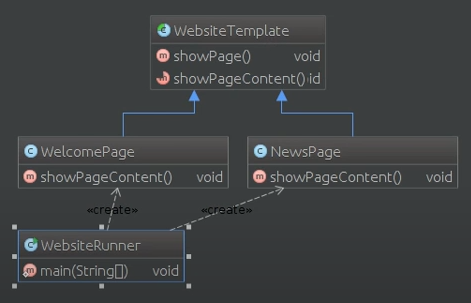

# Шаблоны проектирования

---

## *Порождающие шаблоны*

---

Шаблон: Фабрика (Factory Method)
-
**Цель**: 

- Создание интерфейся, который создает объект. При этом, выбор того, экземпляр какого класса создавать остается за классами,
которые имплементируют данный интерфейс.

**Для чего используется**: 

- Для делегирования создания экземпляров другому классу.

**Пример использования**: 

- Заранее неизвестно, экземпляры какого класса нужно будет создавать;
- Класс спроектирован таким образом, что создаваемые им объекты имеют свойства определенного класса;

**UML Diagram Factory Method in example code**: 

---

Шаблон: Абстрактная фабрика (Abstract Factory)
-
**Цель**: 

- Создание интерфейся, для создания множества взаимосвязанных или взаимозависимых объектов, без жесткой привязке к конкретным классам.

**Для чего используется**: 

- Для создания множества взаимосвязанных объектов.

**Пример использования**: 

- Система не должна зависеть от метода создания, компоновки и представления входящих в неё объектов;
- Входящие взаимосвязанные объекты должны использоваться вместе;
- Система должна конфигурироваться одним из множества объектов, из которых она состоит;
- Нам необходимо представить множество объектов, раскрывая только их интерфейсы, но не реализацию;

**UML Diagram Abstract Factory in example code**: 

---

Шаблон: Одиночка (Singleton)
-
**Цель**: 

- Гарантировать, что у класса будет только один единственный экземпляр и к нему будет представлена глобальная точка доступа.

**Для чего используется**: 

- Для создания единственного экземпляра определенного класса.

**Пример использования**: 

- Необходим только один экземпляр определенного класса, который доступен для всех клиентов;
- Единственный экземпляр должен наследоваться путем порождения подклассов, при этом, клиенты имеют возможность 
  работать с классом-наследником без модификации своего кода;

**UML Diagram Singleton in example code**: 

---

Шаблон: Строитель (Builder)
-
**Цель**: 

- Отделить конструирование сложного объекта от его представления таким образом, чтобы в результате одного и того же
  конструирования мы могли получить разные представления.

**Для чего используется**: 

- Для создания различных объектов из одного набора данных.

**Пример использования**: 

- Порядок создания сложного объекта не должен зависеть от того, из каких частей состоит объект и того, 
  как эти объекты взаимосвязаны;
- Процесс конструирования объекта должен представлять различные представления объекта, который мы конструируем;

**UML Diagram Builder in example code**: 

---

Шаблон: Прототип (Prototype)
-
**Цель**: 

- Определить вид создаваемых объектов с помощью экземпляра - прототипа и создать новые объекты, копируя этот прототип.

**Для чего используется**: 

- Для создания копий заданного объекта.

**Пример использования**: 

- Классы, экземпляры которых необходимо создать, определяются во время выполнения программы;
- Для избежания построения иерархии классов, фабрик или параллельных иерархий классов;
- Экземпляры классов могут находится в одном из немногих возможных состояний;

**UML Diagram Prototype in example code**: 

---

## *Структурные шаблоны*

---

Шаблон: Адаптер (Adapter)
-
**Цель**: 

- Преобразование интерфейса одного класса в интерфейс того класса, который необходим клиенту.

**Для чего используется**: 

- Для обеспечения совместной работы классов, интерфейсы которых не совместимы.

**Пример использования**: 

- Интерфейс класса, который мы хотим использовать не соответствует нашим потребностям;
- Необходим класс, который должен взаимодействовать с классами, которые ему неизвестны или не связаны с ним;
- Необходимо использовать несколько существующих подклассов, но нецелесообразно использовать методы этих классов, создавая их новые подклассы;

**UML Diagram Adapter in example code**: 

---
Шаблон: Мост (Bridge)
-
**Цель**: 

- Отделить абстракцию от её реализации таким образом, чтобы мы могли изменять независимо друг от друга и то и другое.

**Для чего используется**: 

- Для получения преимуществ наследования без потери гибкости.

**Пример использования**: 

- Предотвращение жесткой привязки абстракции к реализации (например, реализацию необходимо выбрать во время выполнения программы);
- В будущем мы хотим расширять с помощью подклассов и реализацию и абстракцию;
- Если изменения в реализации не должны отражаться на клиентах абстракции;
- Для разделения одной реализации между несколькими объектами и не показывать это клиенту;

**UML Diagram Bridge in example code**: 

---

Шаблон: Компоновщик (Composite)
-
**Цель**: 

- Скомпонировать объекты в структуры по типу "дерева", позволяя клиентам единообразно трактовать отдельные и составные объекты.

**Для чего используется**: 

- Для группировки мелких компонентов в более крупные, которые, в свою очередь, могут стать основной для ещё более крупных структур.

**Пример использования**: 

- Для представления иерархии "часть-целое";
- Мы хотим, чтобы клиенты одним способом трактовали как отдельные, так и составные объекты;

**UML Diagram Composite in example code**: 

 - неверная картинка

---

Шаблон: Декоратор (Decorator)
-
**Цель**: 

- Динамическое добавление новых обязанностей объекту.

**Для чего используется**: 

- Используется в качестве альтернативы порождению подклассов для расширения функциональности.

**Пример использования**: 

- Динамическое и понятное клиентам добавление обязанностей объектам;
- Реализация обязанностей, которые могут быть сняты с объекта;
- Расширение класса путем порождения подклассов невозможно по каким-либо причинам;

**UML Diagram Decorator in example code**: 

 

---
 
Шаблон: Фасад (Facade)
-
**Цель**: 

- Предоставить унифицированный интерфейс вместо нескольких интерфейсов подсистемы.

**Для чего используется**: 

- Используется для определеения интерфейса высокого уровня, который упрощает использование подсистемы.

**Пример использования**: 

- Изолирование клиентов от компонентов подсистемы, упрощая работу с ней;
- Необходимость ослабления связанности подсистемы с клиентами;

**UML Diagram Facade in example code**: 

 

---

Шаблон: Приспособленец (Flyweight)
-
**Цель**: 

- Поддержка множества мелких объектов.

**Для чего используется**: 

- Используется разделение для того, чтобы поддерживать много мелких объектов.

**Пример использования**: 

- Когда используется большое число объектов;
- Большую часть состояния объектов можно вынести наружу;
- Приложение не зависит от идентичности объекта;

**UML Diagram Flyweight in example code**: 

 

---

Шаблон: Прокси (Proxy)
-
**Цель**: 

- Для замещения другого объекта и контроля доступа к нему.

**Для чего используется**: 

- Для обеспечения контроля доступа к определенному объекту.

**Пример использования**: 

- Когда есть необходимость ссылаться на объект способом отличным от обычного указателя; 
  - *удаленное замещение* - локальный представитель вместо объекта в другом адресном пространстве.
  - *виртуальное замещение* - создание "тяжелых объектов" при необходимости.
  - *защищенное замещение* - контроль доступа к указанному объекту.
  - *"умная" ссылка* - замена обычного указателя (подсчет числа ссылок, установка блокировки и т.д.)

**UML Diagram Proxy in example code**: 

 

---

## *Поведенческие шаблоны*

---

Шаблон: Цепочка ответственности (Chain of Responsibility)
-
**Цель**: 

- Связывание объектов-получателей в цепочку и передача запроса по ней.

**Для чего используется**: 

- Помогает избежать привязки отправителя запроса к его получателю, что дает возможность обрабатывать данный запрос
  нескольким объектам.

**Пример использования**: 

- Ослабление привязанности (объект не должен знать, кто именно обработает его запрос);
- Дополнительная гибкость при распределении обязанностей между объектами;

**UML Diagram Chain of Responsibility in example code**: 

 

---

Шаблон: Команда (Command)
-
**Цель**: 

- Инкапсулирование запроса в объект.

**Для чего используется**: 

- Чтобы задать параметры клиентов для обработки определенных запросов, создание очереди из этих запросов
  или их контроля и поддержки операций.

**Пример использования**: 

- Параметризация объектов выполняемым действием;
- Определить запрос, ставить его в очередь или выполнять его в разное время;

**UML Diagram Command in example code**: 

 

---

Шаблон: Интерпретатор (Interpreter)
-
**Цель**: 

- Определение представления грамматики объекта.

**Для чего используется**: 

- Используется для определения грамматики заданного языка и интерпретации его предложений.

**Пример использования**: 

- Упрощение иерархии классов с помощью интерпретирования;

**UML Diagram Interpreter in example code**: 

 

---

Шаблон: Итератор (Iterator)
-
**Цель**: 

- Получение последовательного доступа ко всем элементам составного объекта.

**Для чего используется**: 

- Для получения последовательного доступа ко всем элементам составного объекта, скрывая его внутреннее представление.

**Пример использования**: 

- Различные виды обхода составного объекта;
- Упрощенный доступ к составному объекту;

**UML Diagram Iterator in example code**: 

 

---

Шаблон: Посредник (Mediator)
-
**Цель**: 

- Инкапсуляция способа взаимодействия множества объектов.

**Для чего используется**: 

- Для определения объекта, который инкапсулирует способ взаимодействия множества объектов и обеспечения слабой связи между этими объектами.

**Пример использования**: 

- Связи между объектами сложны и чётко определены;
- Нельзя повторно использовать объект, так как он обменивается информацией с другими объектами;
- Поведение, распределенное между несколькими классами должно легко настраиваться без создания подклассов;

**UML Diagram Mediator in example code**: 

 

---

Шаблон: Хранитель (Memento)
-
**Цель**: 

- Сохранить внутреннее состояние объекта за его пределы.

**Для чего используется**: 

- Фиксирование внутреннего состояния объекта за его пределами не нарушая инкапсуляцию и востановления объекта в случае необходимости.

**Пример использования**: 

- Необходимо сохранить текущее состояние объекта или его части и восстановление в будущем, но прямое получение состояния раскрывает детали реализации 
  и нарушает инкапсуляцию объекта;

**UML Diagram Memento in example code**: 

 

---

Шаблон: Наблюдатель (Observer)
-
**Цель**: 

- Определение зависимости "один ко многим" между объектами.

**Для чего используется**: 

- Определение зависимости "один ко многим" между объектами таким образом, что при изменении состояния одного объекта все зависящие от него объекты 
  были уведомлены об этом и обновились.

**Пример использования**: 

- Когда у модели имеются два аспекта, один из которых зависит от другого. Инкапсулирование этих аспектов в разные классы позволяют использовать 
  их независимо друг от друга;
- Когда один объект должен оповещать другие и не делать предположений об этих объектах;
- Ослабление связи между объектами;

**UML Diagram Observer in example code**: 

 

---

Шаблон: Состояние (State)
-
**Цель**: 

- Управление поведением объекта в зависимости от состояния.

**Для чего используется**: 

- Позволяет нам управлять поведением объекта в зависимости от внутреннего состояния объекта.

**Пример использования**: 

- Поведение объекта зависит от его состояние и изменяется во время выполнения;
- Когда встречается большое количество условных операторов, когда выбор ветви зависит от состояния объекта;

**UML Diagram State in example code**: 

 

---

Шаблон: Стратегия (Strategy)
-
**Цель**: 

- Взаимозаменяемость семейства классов.

**Для чего используется**: 

- Определение семейства классов, инкапсулирование каждого из них и организация их взаимозаменяемости.

**Пример использования**: 

- Есть несколько родственных классов, которые отличаются поведением;
- Необходимо иметь несколько вариантов поведения;
- В классе есть данные, о которых не должен знать клиент;
- С помощью условных операторов в классе определено большое количество возможных поведений;

**UML Diagram Strategy in example code**: 

 

---

Шаблон: Шаблонный метод (Template method)
-
**Цель**: 

- Определение основы класса и создание возможности подклассам переопределять его части.

**Для чего используется**: 

- Определяет основу класса и позволяет подклассам переопределять некоторые его части 
  не изменяя его структуру в целом.

**Пример использования**: 

- Однократное использование различных частей класса, оставляя реализацию изменяющегося поведения 
  на усмотрение подклассов;
- Вычленение и локализация общего для всех подклассов поведения в родительском;
- Управление расширениями подклассов;

**UML Diagram Template method in example code**: 

 

---

Шаблон: Посетитель (Visitor)
-
**Цель**: 

- Описание действий, которые выполняются с каждым объектом в некоторой структуре.

**Для чего используется**: 

- Описание операций, которые выполняются с каждым объектом из некоторой структуры.
Позволяет определить новую операцию без изменения классов этиъ объектов.

**Пример использования**: 

- В структуре присутствуют объекты многих классов с различными интерфейсами и нам
  необходимо выполнить над ними операции, которые зависят от конкретных классов;
- Необходимо выполнять не связанные между собой операции над объектами, которые 
  входят в состав структуры и мы не хотим добавлять эти операции в классы;
- Классы, которые устанавливают структуру объектов редко изменяются, но часто добавляются
  новые операции над этой структурой;

**UML Diagram Visitor in example code**: 

---